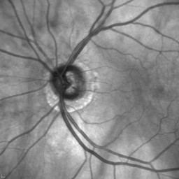
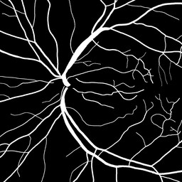

# OCT-Image-Segmentation-ML
Optical coherence tomography (OCT) image segmentation with a Convolutional Neural Network. Long work in progress...

Goal:

(a) Input image | (b) Ground truth  | (c) Segmentation prediction - tbd
--------------- | ----------------- | ---------------------------------
 | 

