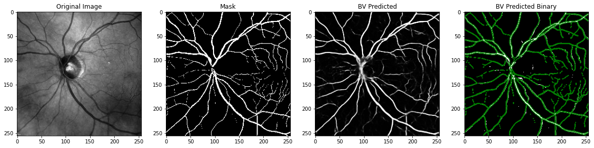

# OCT-Image-Segmentation-ML
Optical coherence tomography (OCT) image segmentation with a U-Net. 

Followed this tutorial:
* [Code](https://github.com/hlamba28/UNET-TGS/blob/master/TGS%20UNET.ipynb)
* [Article](https://towardsdatascience.com/understanding-semantic-segmentation-with-unet-6be4f42d4b47)

## Process: 

- [x] Acquire data
- [x] Segment images
- [x] Preprocess images
- [x] Code, train, validate, test U-Net

### Acquiring data
  OCT scans were acquired manually through scanning subjects as part of other studies conducted by the [Demer Ocular Motility Lab](https://www.uclahealth.org/eye/ocular-motility). Subjects included both controls and those with optic neuropathies.
  
### Manual segmentation 
  Manual segmentation of the scans were done using Adobe Photoshop. 
  
### Preprocessing images
  Images were converted to grayscale (original scans) and binary (masks). Some of the manual segmentation were not completely binary, which was accounted for by setting the values to 0 and 1 in the code. 

### [UNET - building, testing, training, validation](https://github.com/jessicaychen/OCT-Image-Segmentation-ML/blob/master/UNET_OCT_Blood_Vessel_Segmentation.ipynb)

## Results

## Further Improvements to be Made:
- [ ] Dataset augmentation
- [ ] Hyperparameter tuning
- [ ] Different metrics for accuracy

